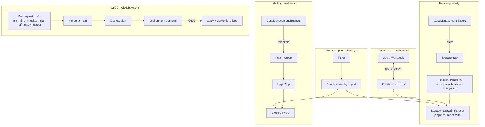

# Azure Cost Visibility Platform

**Turn an opaque Azure bill into something a business owner can read, predict, and explain — automatically.**

[](https://github.com/<your-org>/<repo>/actions/workflows/ci.yml)
[](LICENSE)

A serverless, fully-automated platform that ingests Azure Cost Management data, translates raw service names into business-readable categories (`Microsoft.Compute` → *Servers*), serves a filterable dashboard, alerts the moment spend crosses a budget threshold, and emails a weekly plain-English report. Everything is infrastructure-as-code; the only human action in the whole system is merging a pull request.

It's built to be lean on purpose — a tool whose job is cutting cloud waste shouldn't be wasteful itself, so it runs on pay-per-use components for **single-digit dollars a month**.

---

## Screenshots

| Dashboard | Budget alert | Weekly report |
|-----------|--------------|---------------|
|  |  |  |

*(Populated with the built-in demo seed — see [Demo mode](#demo-mode).)*

---

## How it works

The system is three independent loops plus a deploy pipeline.



- **Data loop (scheduled).** A native Cost Management export drops a daily file in the `raw` container; a timer-triggered Function maps each service to a business category, normalises it, and writes one Parquet blob per billing period to `curated`. Reprocessing *overwrites* the period rather than appending, so restated cost data stays correct.
- **Dashboard (on demand).** Azure Workbooks can't read Parquet, so a thin `read-api` Function aggregates `curated` server-side and returns exactly the JSON each panel needs. Six filters (range, subscription, resource group, category, cost type, granularity) are passed as query params.
- **Alerting (real time).** Cost Management Budgets fire at 50/80/100% thresholds → Action Group → Logic App → a branded email. The alert states which threshold you crossed, your % of budget, and the projected month-end spend.
- **Weekly report (scheduled).** A Monday-morning Function emails a plain-English digest: month-to-date vs budget, spend by category, and the biggest week-over-week movers (increases flagged in red).

Full reasoning is in [docs/04-architecture.md](docs/04-architecture.md).

## Tech stack, and why

| Area | Choice | Why |
|------|--------|-----|
| Infrastructure | **Terraform** (modular, remote state) | One declarative source of truth; every environment/tenant is a re-composition of the same modules. |
| Compute | **Azure Functions** (Python 3.11, Consumption) | Pay-per-execution; no idle servers for a daily/weekly cadence. |
| Store | **Blob Storage + Parquet** (`raw` + `curated`) | One restate-able source of truth — *not* a log store or a second BI copy to keep in sync. |
| Dashboard | **Azure Workbook** over the read-API | Native to the portal; no external BI tool or license. |
| Alerting | **Cost Management Budgets → Logic App → ACS email** | Budgets evaluate in real time; the Logic App sends via Azure Communication Services using its managed identity. |
| CI/CD | **GitHub Actions** — CI on every PR (fmt, tflint, checkov, plan; ruff, mypy, pytest ≥80%), then a deploy workflow that plans, waits for approval, and applies on merge | Every change is linted, security-scanned, and tested; deploy runs only after a manual approval. |
| Deploy auth | **OIDC (Workload Identity Federation)** | No stored deployment secrets. |

Just as important is what was **deliberately left out** — Event Grid, Data Factory/Synapse/Databricks, Log Analytics as a cost store, medallion layering, and Power BI. Each was considered and excluded as heavier than this data volume justifies. That discipline is part of the design; the reasoning is recorded in [docs/07-decision-log.md](docs/07-decision-log.md).

## Security model

- **No secrets in source, config, or pipeline variables.** The single runtime secret (the ACS connection string) lives in **Key Vault** and is read at runtime via managed identity.
- **Deployment uses OIDC** (Workload Identity Federation) — no service-principal secret is stored to enable `terraform apply`.
- **Every component runs under a managed identity** with **least-privilege RBAC** — scoped Storage and Key Vault roles, nothing broader. The alert Logic App sends email via its own identity (no key at all).
- **Deploy is gated** behind a pull request, CI, and a manual approval environment; infrastructure is never applied from a developer machine.

## Cost to run

Built from consumption-billed components, so a low-traffic deployment typically costs **a few dollars a month**: Functions (covered largely by the free grant), a few cents of Blob storage, per-email ACS charges, per-action Logic App runs, and per-operation Key Vault/Application Insights. There is nothing always-on to pay for.

## How it's built and deployed

It runs on **GitHub Actions**. The **CI** workflow validates every pull request — `terraform fmt`, `tflint`, `checkov`, and a `terraform plan`, plus `ruff`, `mypy`, and `pytest` (coverage-gated at 80%). The **Deploy** workflow runs on merge to `main`: it plans, waits for a **manual approval** on a protected `production` environment, then applies the reviewed plan and ships the function code — all authenticated to Azure with **OIDC** (no stored secret). Infrastructure is never applied from a developer machine.

The same plan → approve → apply flow is also provided for **Azure DevOps** (`azure-pipelines.yml`), for teams standardised on ADO — see [Alternative: deploy via Azure DevOps](docs/00-setup.md#alternative-deploy-via-azure-devops).

## Quickstart

Full, ordered runbook: **[docs/00-setup.md](docs/00-setup.md)**. In short:

1. Bootstrap remote state (`terraform/bootstrap`).
2. Create the Azure DevOps project, OIDC service connection, approval environment, and pipeline; set the `alertEmail` pipeline variable.
3. Grant the deploy identity its data-plane roles (one-time; the runbook has exact commands).
4. Copy `terraform/envs/dev/terraform.tfvars.example` → `terraform.tfvars`, set your values, and let the pipeline plan → approve → apply.

## Demo mode

Real spend on a fresh subscription is pennies, so the dashboard and emails would look empty. `scripts/seed_demo_data.py` writes ~6 months of realistic, synthetic cost data straight into the `curated` container so every panel and email renders with believable figures. It's clearly opt-in and easy to remove — see step 8 of the setup runbook.

## Repository layout

```
terraform/            Infrastructure as code
  bootstrap/          Remote-state storage (run once)
  envs/dev/           Root composition for the dev environment
  modules/            cost-exports · data-pipeline · budgets-alerts · notification · reporting
functions/            Python Azure Functions (transform · read-api · weekly-report) + tests
docs/                 Architecture, tech stack, decision log, setup runbook, lessons learned
scripts/              Demo-data seeder
.github/workflows/    GitHub Actions — CI (ci.yml) and Deploy (deploy.yml)
azure-pipelines.yml   Azure DevOps pipeline (alternative deploy path)
```

## Documentation

- [01 — Executive summary](docs/01-executive-summary.md) · the problem and the outcome
- [03 — Tech stack](docs/03-tech-stack.md) · choices and constraints
- [04 — Architecture](docs/04-architecture.md) · the three loops and the security model
- [07 — Decision log](docs/07-decision-log.md) · what was settled, and why
- [00 — Setup](docs/00-setup.md) · deploy from scratch
- [09 — Troubleshooting & lessons learned](docs/09-deployment-troubleshooting.md) · the real gotchas of a serverless + IaC build

## License

[MIT](LICENSE) © 2026 Robert Long (AtLongLast Analytics)
